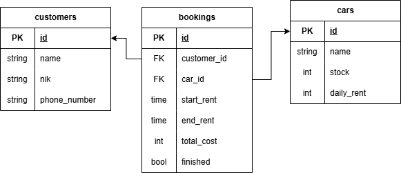

# Car Rental API

Backend API sederhana untuk manajemen rental mobil menggunakan Go, Fiber v3, GORM, dan PostgreSQL.

API ini menyediakan CRUD untuk:

- customer
- car
- booking

Selain CRUD dasar, modul booking sudah memiliki business rule utama:

- membuat booking akan mengurangi `stock` mobil
- `total_cost` dihitung otomatis dari durasi sewa dan `daily_rent`
- update booking akan menghitung ulang `total_cost` jika mobil atau tanggal berubah
- perubahan status `finished` akan memengaruhi stok mobil
- perpindahan mobil pada booking aktif juga menyesuaikan stok mobil lama dan mobil baru

## Teknologi

- Go
- Fiber v3
- GORM
- PostgreSQL
- Swaggo / Swagger UI

## Struktur Data

### Entitas

- `customers`
  - menyimpan data penyewa
- `cars`
  - menyimpan data mobil dan stok yang tersedia
- `bookings`
  - menyimpan transaksi rental yang menghubungkan customer dan car

### Ringkasan ERD

- Satu customer dapat memiliki banyak booking
- Satu car dapat memiliki banyak booking
- Satu booking hanya terkait ke satu customer dan satu car

### Gambar ERD



## Endpoint API

Base URL:

```text
/api/v1
```

### Health Check

- `GET /ping`

### Customers

- `GET /api/v1/customers/`
- `GET /api/v1/customers/:id`
- `POST /api/v1/customers/`
- `PUT /api/v1/customers/:id`
- `DELETE /api/v1/customers/:id`

### Cars

- `GET /api/v1/cars/`
- `GET /api/v1/cars/:id`
- `POST /api/v1/cars/`
- `PUT /api/v1/cars/:id`
- `DELETE /api/v1/cars/:id`

### Bookings

- `GET /api/v1/bookings/`
- `GET /api/v1/bookings/:id`
- `POST /api/v1/bookings/`
- `PUT /api/v1/bookings/:id`
- `DELETE /api/v1/bookings/:id`

## Menjalankan Project

### 1. Siapkan environment variable

Buat file `.env` dengan isi seperti berikut(dapat disesuaika):

```env
APP_PORT=3000
DB_HOST=localhost
DB_PORT=5432
DB_USER=postgres
DB_PASSWORD=postgres
DB_NAME=car_rental
```

### 2. Jalankan dependency dan generate Swagger docs

```bash
go mod tidy
swag init -g cmd/main.go -o docs
```

### 3. Jalankan aplikasi

```bash
go run ./cmd
```

Server akan berjalan di:

```text
http://localhost:3000
```

Swagger UI:

```text
http://localhost:3000/swagger/index.html
```

## Request Body yang Dipakai

### Create / Update Customer

```json
{
  "name": "Yudi Pratama",
  "nik": "1234567890",
  "phone_number": "089789101234"
}
```

### Create / Update Car

```json
{
  "name": "Toyota Camry",
  "stock": 1,
  "daily_rent": 1000000
}
```

### Create Booking

`total_cost` tidak perlu dikirim karena dihitung oleh service.

```json
{
  "customer_id": 1,
  "car_id": 1,
  "start_rent": "2026-03-13T09:00:00Z",
  "end_rent": "2026-03-15T09:00:00Z"
}
```

### Update Booking

`total_cost` tidak perlu dikirim karena akan dihitung ulang oleh service.

```json
{
  "customer_id": 1,
  "car_id": 1,
  "start_rent": "2026-03-13T09:00:00Z",
  "end_rent": "2026-03-16T09:00:00Z",
  "finished": false
}
```

## Skenario Pengujian End-to-End

Bagian ini dibuat seperti cerita penggunaan sistem, tetapi tetap memakai seluruh API yang tersedia.

### Cerita

Sebuah rental mobil menerima customer baru bernama Yudi Pratama. Admin kemudian menambahkan dua mobil ke katalog. Setelah itu Yudi memesan satu mobil untuk beberapa hari. Saat booking dibuat, stok mobil harus berkurang dan total biaya harus terhitung otomatis. Di tengah jalan, durasi booking diperpanjang. Setelah mobil dikembalikan, status booking diubah menjadi selesai dan stok mobil harus kembali bertambah. Setelah seluruh proses selesai, admin mengecek ulang semua data lalu mencoba operasi hapus.

### Langkah Uji

#### 1. Cek health endpoint

```bash
curl http://localhost:3000/ping
```

#### 2. Buat customer baru

```bash
curl -X POST http://localhost:3000/api/v1/customers/ \
  -H "Content-Type: application/json" \
  -d "{\"name\":\"Yudi Pratama\",\"nik\":\"1234567890\",\"phone_number\":\"089789101234\"}"
```

Catat `id` customer yang dihasilkan. Misal hasilnya `1`.

#### 3. Lihat daftar customer

```bash
curl http://localhost:3000/api/v1/customers/
```

#### 4. Lihat detail customer

```bash
curl http://localhost:3000/api/v1/customers/1
```

#### 5. Update customer

```bash
curl -X PUT http://localhost:3000/api/v1/customers/1 \
  -H "Content-Type: application/json" \
  -d "{\"name\":\"Yudi Pratama Update\",\"nik\":\"1234567890\",\"phone_number\":\"081234567890\"}"
```

#### 6. Tambahkan mobil pertama

```bash
curl -X POST http://localhost:3000/api/v1/cars/ \
  -H "Content-Type: application/json" \
  -d "{\"name\":\"Toyota Camry\",\"stock\":1,\"daily_rent\":1000000}"
```

Misal hasil `id` mobil pertama adalah `1`.

#### 7. Tambahkan mobil kedua

```bash
curl -X POST http://localhost:3000/api/v1/cars/ \
  -H "Content-Type: application/json" \
  -d "{\"name\":\"Honda Civic\",\"stock\":2,\"daily_rent\":750000}"
```

Misal hasil `id` mobil kedua adalah `2`.

#### 8. Lihat semua mobil

```bash
curl http://localhost:3000/api/v1/cars/
```

#### 9. Lihat detail mobil pertama

```bash
curl http://localhost:3000/api/v1/cars/1
```

#### 10. Update data mobil kedua

```bash
curl -X PUT http://localhost:3000/api/v1/cars/2 \
  -H "Content-Type: application/json" \
  -d "{\"name\":\"Honda Civic RS\",\"stock\":2,\"daily_rent\":800000}"
```

#### 11. Buat booking

Saat booking dibuat:

- stok mobil target harus berkurang
- `total_cost` harus dihitung otomatis
- response booking akan memuat `customer` dan `car`

```bash
curl -X POST http://localhost:3000/api/v1/bookings/ \
  -H "Content-Type: application/json" \
  -d "{\"customer_id\":1,\"car_id\":1,\"start_rent\":\"2026-03-13T09:00:00Z\",\"end_rent\":\"2026-03-15T09:00:00Z\"}"
```

Misal hasil `id` booking adalah `1`.

#### 12. Cek semua booking

```bash
curl http://localhost:3000/api/v1/bookings/
```

#### 13. Cek detail booking

```bash
curl http://localhost:3000/api/v1/bookings/1
```

#### 14. Ubah booking karena durasi sewa diperpanjang

Pada langkah ini:

- `total_cost` harus dihitung ulang
- stok tetap aman karena mobil tidak berubah dan booking belum selesai

```bash
curl -X PUT http://localhost:3000/api/v1/bookings/1 \
  -H "Content-Type: application/json" \
  -d "{\"customer_id\":1,\"car_id\":1,\"start_rent\":\"2026-03-13T09:00:00Z\",\"end_rent\":\"2026-03-16T09:00:00Z\",\"finished\":false}"
```

#### 15. Ubah booking ke mobil lain

Pada langkah ini:

- stok mobil lama harus kembali
- stok mobil baru harus berkurang
- `total_cost` harus dihitung ulang memakai `daily_rent` mobil baru

```bash
curl -X PUT http://localhost:3000/api/v1/bookings/1 \
  -H "Content-Type: application/json" \
  -d "{\"customer_id\":1,\"car_id\":2,\"start_rent\":\"2026-03-13T09:00:00Z\",\"end_rent\":\"2026-03-16T09:00:00Z\",\"finished\":false}"
```

#### 16. Selesaikan booking

Pada langkah ini:

- status `finished` berubah menjadi `true`
- stok mobil yang dipakai harus kembali bertambah

```bash
curl -X PUT http://localhost:3000/api/v1/bookings/1 \
  -H "Content-Type: application/json" \
  -d "{\"customer_id\":1,\"car_id\":2,\"start_rent\":\"2026-03-13T09:00:00Z\",\"end_rent\":\"2026-03-16T09:00:00Z\",\"finished\":true}"
```

#### 17. Verifikasi akhir

Lihat kembali booking:

```bash
curl http://localhost:3000/api/v1/bookings/1
```

Lihat kembali mobil:

```bash
curl http://localhost:3000/api/v1/cars/1
curl http://localhost:3000/api/v1/cars/2
```

#### 18. Uji delete booking

```bash
curl -X DELETE http://localhost:3000/api/v1/bookings/1
```

#### 19. Uji delete car

```bash
curl -X DELETE http://localhost:3000/api/v1/cars/1
curl -X DELETE http://localhost:3000/api/v1/cars/2
```

#### 20. Uji delete customer

```bash
curl -X DELETE http://localhost:3000/api/v1/customers/1
```

## Checklist Hasil yang Diharapkan

- customer berhasil dibuat, dilihat, diupdate, dan dihapus
- car berhasil dibuat, dilihat, diupdate, dan dihapus
- booking berhasil dibuat, dilihat, diupdate, dan dihapus
- saat booking dibuat, stok mobil berkurang
- saat booking selesai, stok mobil bertambah kembali
- saat mobil booking diganti, stok mobil lama dan baru ikut menyesuaikan
- `total_cost` selalu dihitung otomatis oleh service
- response booking menampilkan data relasi `customer` dan `car`

## Catatan

- Project ini memakai `AutoMigrate`, jadi tabel akan dibuat/diupdate saat aplikasi start
- Swagger docs harus digenerate ulang setelah perubahan anotasi:

```bash
swag init -g cmd/main.go -o docs
```
